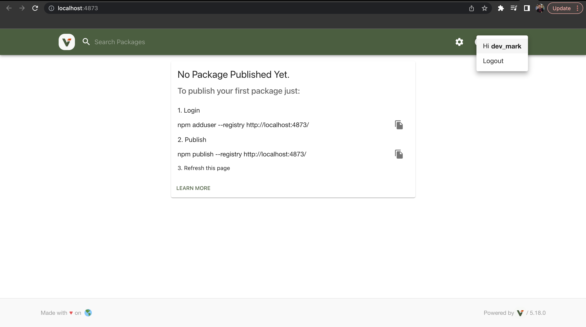
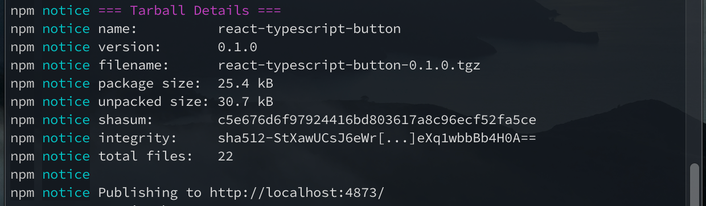

The reason why you will do that is you don't want to make your package publicly available or
your company wants it to be private, something like it can only be used within your organization.

First, Let's create our simple react-typescript package. We will be creating `a customizable button component package`.

### Create React-Typescript package

1. Just type `npx create-react-app react-typescript-button --template typescript`.
    <p align="center">
        
    </p>

2. After the installation was done, the terminal will look like this.
    <p align="center">
        
    </p>

3. Now let's get into the directory of our project and type `code .` to open our project in VS Code _(this is optional, you can just open your project in IDE you're using)._
    <p align="center">
        
    </p>

4. Under src folder, create a folder named `Components` and under that folder, create another folder named `Button`, under Button folder, create 3 files named `Button.tsx`, `types.ts` and `index.ts`.
    <p align="center">
        
    </p>

    - This will be the content of those files:

        **types.ts**
        ```javascript
            import { CSSProperties } from "react";

            export interface IButtonProps {
                backgroundColor?: CSSProperties["color"];
                fontColor?: CSSProperties["color"];
                value: string;
            }
        ```
         **Button.tsx**
        ```javascript
            import React, { FC } from "react";
            import { IButtonProps } from "./types";

            export const Button: FC<IButtonProps> = ({
                backgroundColor = "lightgray",
                fontColor = "black",
                value,
            }) => {
                return (
                    <button style={{ color: fontColor, backgroundColor: backgroundColor }}>
                    {value}
                    </button>
                );
            };
        ```
         **index.ts**
        ```javascript
            export { Button } from "./Button";
        ```


5. Remove all the contents of the `index.tsx` file and rename it to `index.ts` then add this code below.

    **index.tsx**
    ```javascript
        export { Button } from "./Components/Button";
    ```

6. Go to `tsconfig.json` file then remove all the contents and add this code below.

    **tsconfig.json**
    ```javascript
    {
        "include": ["src"],
        "exclude": ["dist", "node_modules"],
        "compilerOptions": {
            "module": "esnext",
            "lib": ["dom", "esnext"],
            "importHelpers": true,
            "declaration": true,
            "sourceMap": true,
            "rootDir": "./src",
            "outDir": "./dist/esm",
            "strict": true,
            "noImplicitReturns": true,
            "noFallthroughCasesInSwitch": true,
            "noUnusedLocals": true,
            "noUnusedParameters": true,
            "moduleResolution": "node",
            "jsx": "react",
            "esModuleInterop": true,
            "skipLibCheck": true,
            "forceConsistentCasingInFileNames": true
        }
    }
    ```
7. Edit the `package.json`

    - This is where the npm will import the main file of our project from and where will be the types located.
        ```javascript
        "main": "./dist/cjs/index.js",
        "module": "./dist/esm/index.js",
        "types": "./dist/esm/index.d.ts",
        ```
    - Change `private` value from `true` to `false`
    - Use only the allowed files and folders that will be included in the package to avoid having redundant files in it
      ```javascript
        "files": [
            "dist",
            "README.md"
        ]
      ```
    - Replace `scripts` values with this
        ```javascript
        "scripts": {
            "build": "yarn build:esm && yarn build:cjs",
            "build:esm": "tsc",
            "build:cjs": "tsc --module commonjs --outDir dist/cjs",
            "prepare": "npm run build"
        },
        ```
    - Your whole `package.json` file would look like this
    ```javascript
    {
        "name": "react-typescript-button",
        "version": "0.1.0",
        "main": "./dist/cjs/index.js",
        "module": "./dist/esm/index.js",
        "types": "./dist/esm/index.d.ts",
        "private": false,
        "dependencies": {
            "@testing-library/jest-dom": "^5.16.5",
            "@testing-library/react": "^13.4.0",
            "@testing-library/user-event": "^13.5.0",
            "@types/jest": "^27.5.2",
            "@types/node": "^16.18.6",
            "@types/react": "^18.0.26",
            "@types/react-dom": "^18.0.9",
            "react": "^18.2.0",
            "react-dom": "^18.2.0",
            "react-scripts": "5.0.1",
            "typescript": "^4.9.3",
            "web-vitals": "^2.1.4"
        },
        "scripts": {
            "build": "yarn build:esm && yarn build:cjs",
            "build:esm": "tsc",
            "build:cjs": "tsc --module commonjs --outDir dist/cjs",
            "prepare": "npm run build"
        },
        "eslintConfig": {
            "extends": [
            "react-app",
            "react-app/jest"
            ]
        },
        "browserslist": {
            "production": [
            ">0.2%",
            "not dead",
            "not op_mini all"
            ],
            "development": [
            "last 1 chrome version",
            "last 1 firefox version",
            "last 1 safari version"
            ]
        },
        "files": [
            "dist",
            "README.md"
        ]
    }
    ```

For your reference, you can access my created project here [https://github.com/EstopaceMA/react-typescript-button](https://github.com/EstopaceMA/react-typescript-button)
{: .box-note}
    


Now Let's get into the exciting part wherein we will now host our package using `Verdaccio`.

### What is Verdaccio?
 It's a simple, zero-config-required local private NPM registry. No need for an entire database just to get started. Verdaccio comes out of the box with its own tiny database, and the ability to proxy other registries (eg. npmjs.org), also introduces caching the downloaded modules along the way. For those who are looking to extend their storage capabilities, Verdaccio supports various community-made plugins to hook into services such as Amazon's S3, Google Cloud Storage or create your own plugin.

### Verdaccio Installation
 Verdaccio is a Node.js private and proxy registry. To install it, you need a few basic prerequisites.

#### Prerequisites
1. Node.js v12 or higher.
2. Your favorite Node Package Manager npm, pnpm or yarn (classic and berry).
3. A modern web browser to run the web interface. We actually support Chrome, Firefox, Edge.

#### Installation
1. **Using NPM** 
    ```
    npm install --location=global verdaccio
    ```

    It will look like this if installation was done.
    <p align="center">
        
    </p>

2. Now, run verdaccio in command line
    <p align="center">
        
    </p>

3. Go to the provided http address which is `http://localhost:4873/` then follow the intruction there.
    <p align="center">
        
    </p>

    1. Login
        - Open another terminal and use this command.
        ```
        npm install --location=global verdaccio
        ```
        - You will need to add your `username`, `password` and `email`.
        <p align="center">
            
        </p>
        - Go back again to `http://localhost:4873/` and then login your created account.
        <p align="center">
            
        </p>
        - We're done on the first step. Now let's move on to publishing our package.

    2. Publish
        - Go to the directory of your application. Now type this command.
        ```
        npm publish --registry http://localhost:4873/
        ```
        - It will look like this if it was published successfully.
        <p align="center">
            
        </p>
        - Go to `http://localhost:4873/` again and now you can see your package was already published.
        <p align="center">
            
        </p>

**Now that our package was already published. Let's install it and use it on our app.**


### How to install and use our published package
1. Create a new React-Typescript project or if you already have one just skip it.
2. Use this command to install the package.
    ```javascript
    npm install react-typescript-button --registry=http://localhost:4873/
    ```
3. Use the package by importing it.
    ```javascript
    import { Button } from 'react-typescript-button';
    ```

### We're Done!
To summarize:
- We create a package with React and Typescript.
- Then we deploy it to Verdaccio.

### To learn more about Verdaccio
- Just go to [https://verdaccio.org/](https://verdaccio.org/)

