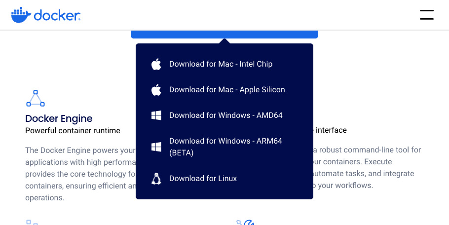

As developers, we are always on the lookout for ways to simplify complex workflows and leverage powerful tools to boost productivity. If you're working with DeepSeek R1, you already know its potential for delivering deep insights and optimizing data-driven operations. However, setting it up locally can be challenging, especially when considering hardware compatibility and configuration requirements.

In this blog, I've used a MacBook Pro M1 (16GB RAM) to run DeepSeek R1 7B—and the performance depends on the device you use. Your experience may vary based on your hardware, but the good news is that you don’t need to write a single line of code to get started. I’ll guide you step-by-step through the setup, integrating it with a user-friendly interface so you can start using it effortlessly.

### Steps:

#### 1. Download and Install Ollama

Start by visiting [https://ollama.com/download](https://ollama.com/download), and download the version appropriate for your operating system.

<p align="center">
    
</p>

---

#### 2. Install the DeepSeek R1 Model

Next, head to [https://ollama.com/library/deepseek-r1](https://ollama.com/library/deepseek-r1). Open your terminal and type the following command:

```
ollama run deepseek-r1
```

This will download and run DeepSeek R1 locally. Once it's done, you'll be able to access it through your terminal. But don't worry, we’re not done yet! Let’s make things easier by connecting it to a user-friendly interface.

<p align="center">
    
</p>

> **Note**: At this point, DeepSeek R1 is running locally, but we can integrate it with an intuitive user interface that requires no coding!

---

#### 3. Download and Install Docker Desktop

Now, we need to install Docker Desktop. Visit [https://www.docker.com/products/docker-desktop](https://www.docker.com/products/docker-desktop) to download the version suited for your OS.

<p align="center">
    
</p>

---

#### 4. Download and Install Open WebUI

Head over to [https://docs.openwebui.com/](https://docs.openwebui.com/), and scroll down to find the `Quick Start with Docker` instructions. Since we’ve already installed Ollama, we can proceed with the following command in your terminal:

```
docker run -d -p 3000:8080 --add-host=host.docker.internal:host-gateway -v open-webui:/app/backend/data --name open-webui --restart always ghcr.io/open-webui/open-webui:main
```

<p align="center">
    
</p>

---

#### 5. Run Open WebUI in Docker Desktop

Once the Docker container is running, open Docker Desktop and find the Open WebUI container. Alternatively, you can manually access it by going to [http://localhost:3000/](http://localhost:3000/).

You’ll be greeted with a sign-up page where you can enter the required information.

<p align="center">
    
</p>

---

### You're All Set!

Congratulations! You’ve successfully set up DeepSeek R1 to run locally with a convenient, no-code interface. Now you can explore and experiment with it as you like!

<p align="center">
    
</p>
