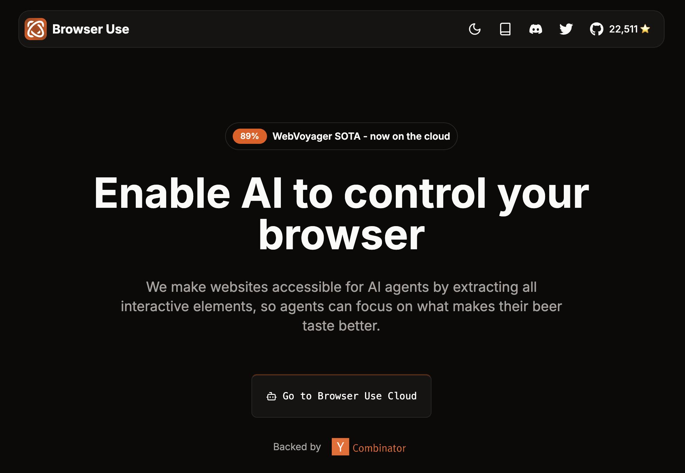
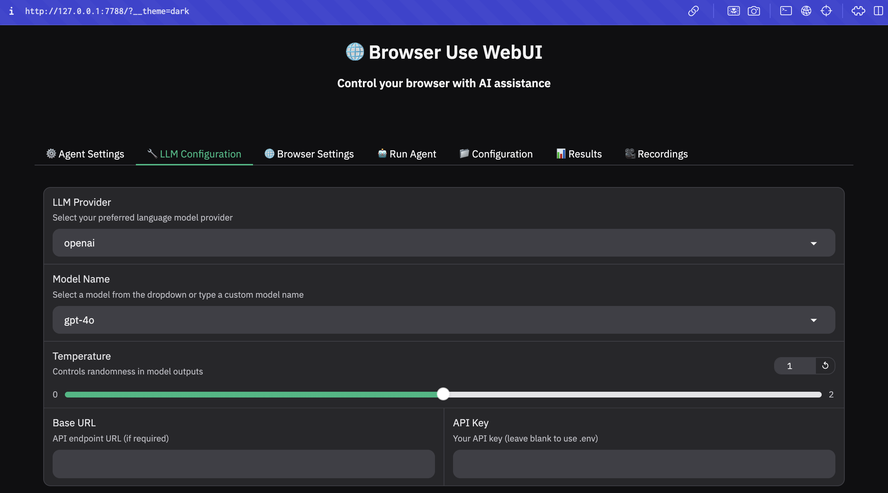

Recently, OpenAI introduced Operator, a research preview of an advanced web agent that can operate its own browser to perform tasks for you. Currently available only to Pro users in the U.S., Operator showcases OpenAI’s vision for AI-powered web automation—navigating websites, extracting data, filling out forms, and more.

<p align="center">
    
</p>
You can learn more about OpenAI Operator here: [https://openai.com/index/introducing-operator](https://openai.com/index/introducing-operator)

---

But what if you could access similar capabilities with open-source alternative?

### Introducing "Browser Use": The Open-Source, Free Alternative

A cutting-edge open-source web agent that gives you full control and flexibility over your web automation. Unlike Operator, it’s available to everyone, everywhere, with the freedom to choose your own AI models.

<p align="center">
    
</p>

- **Advanced Browser Automation** – Enables smooth and intelligent automation of web tasks.
- **Vision + HTML Extraction** – Combines visual understanding with HTML structure analysis for precise web interaction.
- **Multi-Tab Management** – Handles multiple tabs effortlessly for complex workflows and parallel processing.
- **Element Tracking** – Captures clicked element XPaths and replicates LLM actions for consistent automation.
- **Custom Actions** – Supports user-defined actions such as saving data, database operations, notifications, and human input handling.
- **Self-Correcting** – Features intelligent error handling and automatic recovery for robust automation.
- **Broad LLM Support** – Works with all LangChain-compatible LLMs, including GPT-4, Claude 3, and Llama 2.

---

### Try It with the Web UI!

With the Browser Use Web UI, built on Gradio, you can get started in under five minutes. Just launch it in your browser, enter prompts, and watch as it performs tasks while providing real-time results and recordings.

<p align="center">
    
</p>

#### Installation

> source: [https://github.com/browser-use/web-ui](https://github.com/browser-use/web-ui)

Read the [quickstart guide](https://docs.browser-use.com/quickstart#prepare-the-environment) or follow the steps below to get started.

> Python 3.11 or higher is required.

First, we recommend using [uv](https://docs.astral.sh/uv/) to setup the Python environment.

```bash
uv venv --python 3.11
```

and activate it with:

```bash
source .venv/bin/activate
```

Install the dependencies:

```bash
uv pip install -r requirements.txt
```

Then install playwright:

```bash
playwright install
```

---

<div style="position: relative; width: 100%; padding-bottom: 56.25%">
<iframe src="https://www.youtube.com/embed/IIrjD7zbf7A" 
        title="Browser Use - Demo" frameborder="0" allowfullscreen
        allow="accelerometer; autoplay; clipboard-write; encrypted-media; gyroscope; picture-in-picture" 
        style="position: absolute; width: 100%; height: 100%;">
</iframe>
</div>

And just like that, you’re all set to customize prompts to fit your specific needs!

### The Future of AI-Powered Web Automation is Open

OpenAI’s Operator provides a glimpse into the possibilities of AI-driven web automation. However, Browser Use offers a fully open-source, adaptable alternative—giving you complete control over your automation, with the freedom to choose your preferred AI models.

Whether you're streamlining research, data extraction, or complex workflows, Browser Use ensures precision, reliability, and accessibility for all.
