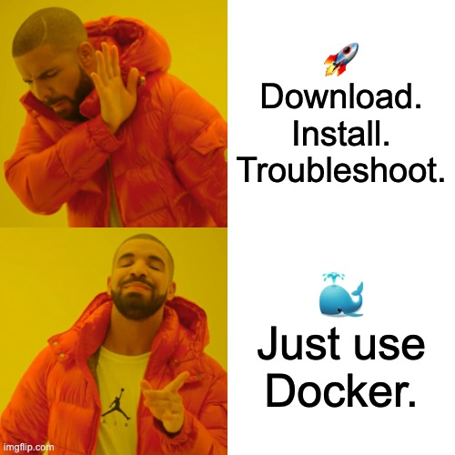

In software development, speed and reliability aren’t just nice-to-haves—they’re expectations. Users want new features fast, businesses want systems that scale, and engineers want deployments that don’t feel like a gamble.

But if your application isn’t containerized, you’re likely making life harder than it needs to be. On the surface, deploying apps the traditional way might seem fine. Over time though, the cracks begin to show.

Here are some problems you’ll eventually face if you don’t containerize your application:

## 1. The “It Works on My Machine” Trap

Without containers, your app is tied directly to the environment it runs on. Different operating system versions, missing libraries, or conflicting configurations often lead to situations where something runs perfectly in development but fails in testing or production.

That gap between environments leads to wasted time and frustrating late-night debugging sessions.

## 2. Inefficient Use of Resources

Running applications directly on servers or virtual machines often means dedicating more CPU, memory, and storage than the app truly needs. You’re essentially running an entire environment for just one service.

It’s not only wasteful—it also makes scaling more expensive than it should be.

## 3. Deployments That Feel Fragile

Without containers, deploying new versions of your application often involves manual steps, complex scripts, or careful adjustments. One small mistake can take down the system.

Rolling back to a stable version isn’t always quick or simple, which leaves your team firefighting instead of moving forward.

## 4. Scaling That Doesn’t Scale Well

As traffic grows, scaling traditionally means provisioning more machines or servers. This takes time, eats up budget, and doesn’t adapt quickly to demand.

Without containers, your ability to grow smoothly is limited. Scaling starts to feel like pushing a boulder uphill.

## 5. Dependency Conflicts

Sharing environments across multiple applications creates headaches. One app might need a specific version of a language or framework, while another requires something different. Trying to make them coexist in the same environment can turn into a fragile balancing act.

Containers solve this by isolating each application, but without them, conflicts are inevitable.

---

So how do you actually start containerizing your applications? This is where **Docker** comes in.

    

Docker is the most widely used platform for creating and running containers. It lets you package your application along with its dependencies into a single, portable image. That image can then run consistently anywhere—on your laptop, on a company server, or in the cloud.

With Docker you can:

- **Build once, run anywhere** – The same image runs across all environments.
- **Simplify deployments** – Ship updates as lightweight images, not messy scripts.
- **Speed up development** – Spin up environments in seconds.
- **Scale easily** – Launch multiple container instances without worrying about conflicts.

---

# How Docker Works

At its core, Docker has a simple but powerful workflow:

    

1. **Dockerfile** – You describe your application and its environment in a plain text file called a _Dockerfile_. This includes the base operating system, dependencies, and how to run the app.
2. **Image** – Docker uses the Dockerfile to build an _image_. An image is like a snapshot of your app and everything it needs to run.
3. **Container** – When you run the image, Docker creates a _container_. This is the actual running instance of your application. You can run many containers from the same image, and each one is isolated from the others.

---

# Benefits of Using Docker

By now you might be wondering: beyond solving the problems we discussed earlier, what makes Docker such a game changer? Here are the key benefits:

- **Portability Across Platforms**  
  Whether it’s a developer laptop, a test server, or the cloud—Docker ensures your app behaves the same everywhere.

- **Lightweight and Fast**  
  Containers start in seconds and use fewer resources than traditional virtual machines.

- **Developer Productivity**  
  Setting up environments takes minutes instead of hours. Teams can test, build, and iterate much faster.

- **Easy Rollbacks and Updates**  
  If a deployment goes wrong, you can quickly roll back to a stable version. Updates are as simple as shipping a new image.

- **Improved Collaboration**  
  Teams can share Docker images just like they share code, ensuring everyone is working with the same setup.

- **Scalability**  
  Applications can be scaled up or down easily by running more containers as needed.

---

    

In short, Docker takes away much of the pain described above and gives your applications a solid foundation to grow without friction.

👉 In the next post, I’ll walk through **how to get started with Docker** and show you how to containerize a simple application step by step.
